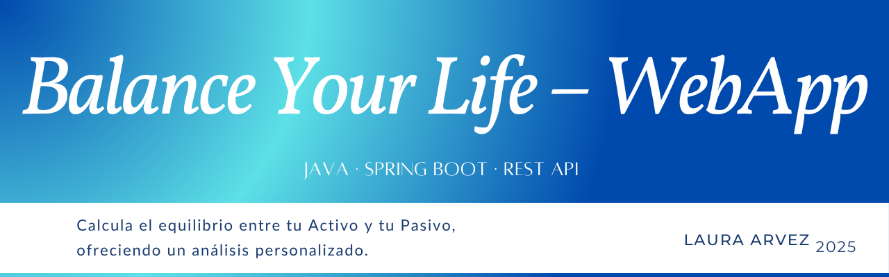

# Balance Your Life – WebApp

Aplicación web que permite evaluar tu **Balance Existencial** a través de los conceptos desarrollados por el psicólogo Antoni Bolinches. Calcula el equilibrio entre tu **Activo** (valores que tienes) y tu **Pasivo** (a lo que debes tu bienestar), ofreciendo un análisis personalizado.

---

## Características

* Formulario para evaluar tu balance existencial (Activo y Pasivo)
* Cálculo automático de totales, diferencia y coherencia
* Mensaje interpretativo basado en el espisodio **Detecta qué falla en tu vida en solo 5 minutos** del podcast **Ojalá la hubiera sabido antes**.
* API REST documentada con Swagger
* Interfaz web conectada al backend (Spring Boot)
* Posibilidad de ver el detalle y descargar en PDF

---

## 🛠️ Tecnologías utilizadas

**Backend**

* Java 17
* Spring Boot 3.5
* Spring Web
* Spring Validation
* Arquitectura Hexagonal (puertos y adaptadores)
* Swagger / OpenAPI 3 (springdoc-openapi)

**Frontend** (totalmente desarrollado con ChatGPT)

* HTML, CSS y JavaScript básico
* localStorage para persistencia temporal de datos

**Otros**

* Maven
* Git y GitHub

---

## ¿Cómo ejecutar el backend localmente?

1. Clona el repositorio:

   ```bash
   git clone https://github.com/lauraArvez/Balance-Your-Life-WebApp.git
   ```
2. Entra en la carpeta del backend:

   ```bash
   cd Balance-Your-Life-WebApp/balance
   ```
3. Compila y ejecuta con Maven:

   ```bash
   ./mvnw spring-boot:run
   ```

La API estará disponible en:
 `http://localhost:8080`

Y la documentación Swagger en:
 `http://localhost:8080/swagger-ui.html`
(o `http://localhost:8080/swagger-ui/index.html` en algunos entornos)

---

##  Estructura del proyecto

```
Balance-Your-Life-WebApp/
│
├── balance/               → Backend Spring Boot
│   ├── src/main/java/...  → Código fuente organizado en capas hexagonales
│   ├── src/main/resources → Configuración y properties
│   └── pom.xml            → Gestión de dependencias
│
├── frontend/              → Archivos HTML, CSS y JS (en desarrollo)
├── README.md
└── .gitignore
```

---

##  Documentación de la API

* La documentación se genera automáticamente con Swagger/OpenAPI.
* Disponible en tiempo de ejecución en el navegador.

### Endpoints principales:

* `POST /api/v1/balance/interpretar` → Devuelve interpretación completa
* `POST /api/v1/balance/resumen` → Devuelve solo totales y coherencia
* `POST /api/v1/balance/query/total-activo` → Solo suma del Activo
* `POST /api/v1/balance/query/total-pasivo` → Solo suma del Pasivo

---

## Autora

**Laura Arvez**
📧 [contacto@lauraarvez.dev](mailto:arvezlau@hotmail.com)
🌐 [https://lauraarvez.github.io/](https://lauraarvez.github.io/)

---

## Licencia

Este proyecto está licenciado bajo la [MIT License](https://opensource.org/licenses/MIT).

---

